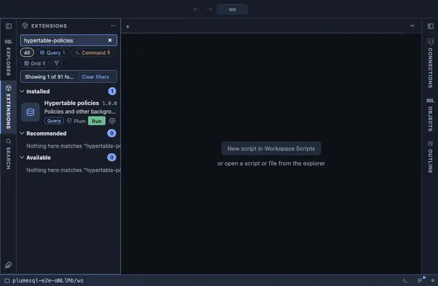

# Hypertable policies

The policies and other background jobs on the hypertable or continuous
aggregate this was opened on, with their configuration and run record.
From the object's row in the object tree; the per-object view of what
Background jobs lists for the whole server.

## What it shows

One row per job bound to the object:

| Column | Meaning |
|---|---|
| id, job, procedure | The job, its name and the procedure it runs. |
| every | Its schedule interval. |
| config | The job's configuration (the policy's parameters), as JSON. |
| enabled | Whether it is scheduled. |
| last run, started, next | The last run's status and start, and the next start. |
| runs, failures | The totals. |

A continuous aggregate's jobs (its refresh policy above all) are
registered on its materialization hypertable, an internal table; the
aggregate's own name is translated, so opening it from the aggregate
answers as expected.

## Requirements

PostgreSQL 13 or newer with the `timescaledb` extension; without it the run answers with the server's own error.

## Notes

Reads only. An `@for hypertable, continuous aggregate` extension:
`{schema}` and `{name}` are the object it was opened on, bound as
parameters.
