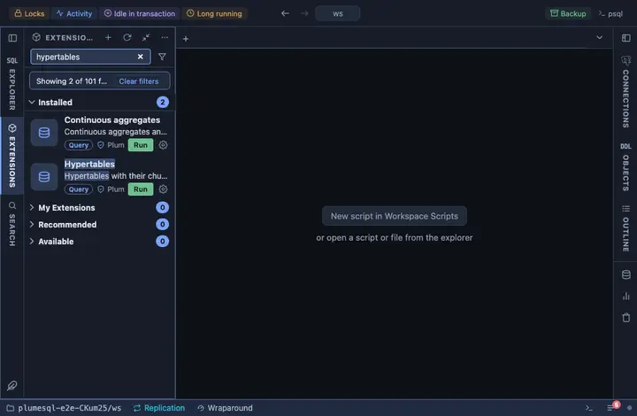

# Hypertables

TimescaleDB's hypertables with their owner, chunk count, compression,
partitioning dimension and size, and any hypertable's chunks one click
away.

## What it shows

One row per hypertable:

| Column | Meaning |
|---|---|
| schema, hypertable | The table. |
| owner | Its owner. |
| chunks | How many chunks it has now. |
| compression | Whether compression is enabled. |
| partitioned by | The primary dimension, usually the time column. |
| size | On disk, every chunk summed. |

**Chunks** on a hypertable opens its chunks, newest range first: the
range each covers, whether it is compressed and when it was created.

## Requirements

PostgreSQL 13 or newer with the `timescaledb` extension; without it the run answers with the server's own error.

## Notes

Reads only. The `timescaledb_information` views and the size function
are deliberately not schema qualified: they live where the extension
was installed, and only the server knows where.
