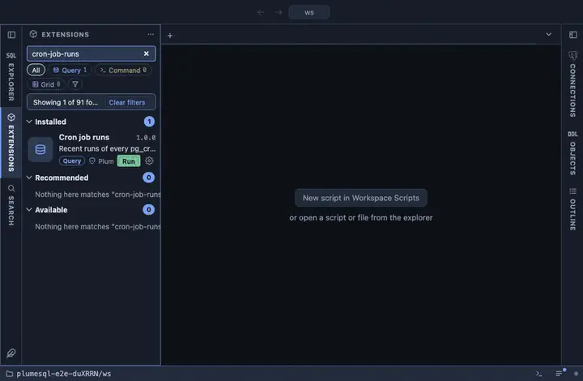

# Cron job runs

The recent runs of every pg_cron job, newest first: which job, how it
ended and what it said, refreshed every thirty seconds while the tab is
visible. The log to watch after scheduling something.

## What it shows

One row per run, the two hundred most recent:

| Column | Meaning |
|---|---|
| run, job, name | The run's id, and the job it belongs to. |
| status | `succeeded`, `failed`, `running`, `starting`. |
| started, ended | When it ran. |
| message | What the command returned, or the error, verbatim. |
| command | The command as scheduled. |

## Requirements

PostgreSQL 13 or newer with the `pg_cron` extension installed in the database this runs in (its jobs are kept where the extension is); without it the run answers with the server's own error. Reading `cron.job_run_details` needs the privileges pg_cron
grants its users on their own jobs, or superuser for everyone's.

## Notes

Refreshes every 30 seconds (`@refresh 30s`) while its tab is the active
one, since runs keep arriving. Reads only. The `cron` schema is the
extension's own fixed one, so it is qualified.
