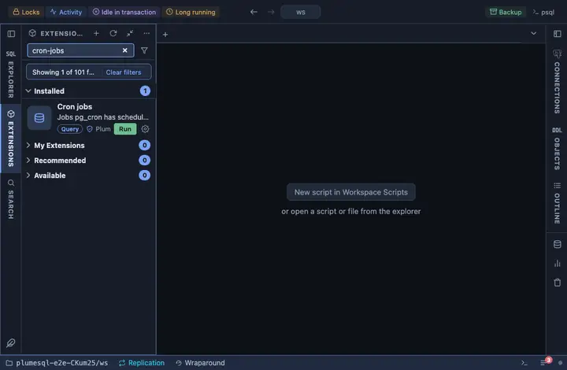

# Cron jobs

The jobs pg_cron has scheduled: schedule, command, database, user and
whether each is active, with any job's recent runs one click away.

## What it shows

One row per job:

| Column | Meaning |
|---|---|
| id, job | The job and its name. |
| schedule | The cron expression, or the interval. |
| command | What it runs. |
| database, user | Where and as whom. |
| node | The node it connects to. |
| active | Whether it is scheduled to run. |

**Runs** on an id opens the job's recent runs, newest first: how each
ended and what it said.

## Requirements

PostgreSQL 13 or newer with the `pg_cron` extension installed in the database this runs in (its jobs are kept where the extension is); without it the run answers with the server's own error. A job scheduled for another database is listed here, in the
database that holds the extension.

## Notes

Reads only; Cron schedule job and Cron unschedule job are the writing
halves. The `cron` schema is the extension's own fixed one, so it is
qualified.
