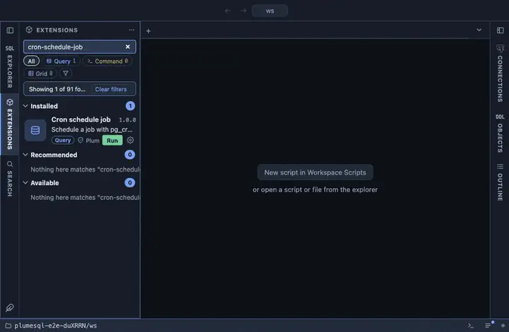

# Cron schedule job

Schedule a job with pg_cron from a form: a name, a cron schedule and the
command it runs, in this database as the current user. It asks first.

## What it does

Asks the three values, confirms, then calls `cron.schedule(name,
schedule, command)`. The answer is the job's id. A job of the same name
is replaced, which the question says.

## Inputs

| Input | Default | Meaning |
|---|---|---|
| job | nightly-vacuum | The job's name. |
| schedule | 0 3 * * * | Cron syntax, or an interval such as `30 seconds`. |
| command | VACUUM ANALYZE | The SQL the job runs. |

## Requirements

PostgreSQL 13 or newer with the `pg_cron` extension installed in the database this runs in (its jobs are kept where the extension is); without it the run answers with the server's own error. The privilege to schedule jobs (pg_cron grants it to superusers
and to roles granted access to the `cron` schema).

## Notes

A writing extension: it asks before it runs (`@confirm`). Every value is
bound as a parameter; nothing is pasted into the statement.
