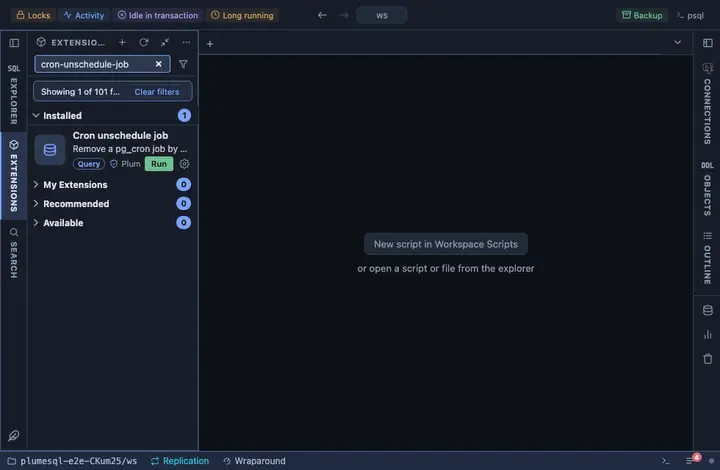

# Cron unschedule job

Remove a pg_cron job by name, from a form. The run history stays.

## What it does

Asks the job's name, confirms, then looks the job up by name and removes
it by its id with `cron.unschedule`. A name nobody scheduled answers
with no row rather than an error.

## Inputs

| Input | Default | Meaning |
|---|---|---|
| job | nightly-vacuum | The name of the job to remove. |

## Requirements

PostgreSQL 13 or newer with the `pg_cron` extension installed in the database this runs in (its jobs are kept where the extension is); without it the run answers with the server's own error. The privilege to unschedule the job (its owner or superuser).

## Notes

A writing extension: it asks before it runs (`@confirm`). The name is
bound as a parameter.
