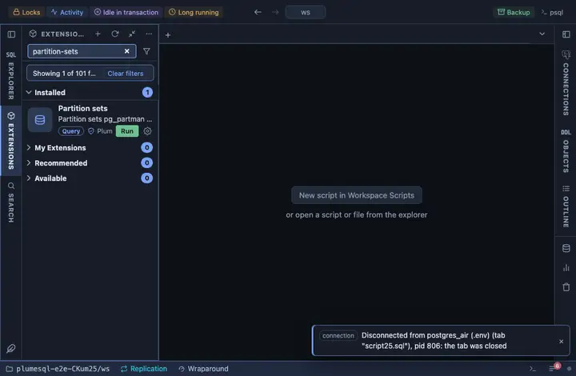

# Partition sets

The partition sets pg_partman maintains: each parent's control column,
interval, premake and retention, and the partitions under any parent
one click away.

## What it shows

One row per partition set:

| Column | Meaning |
|---|---|
| parent | The parent table. |
| control | The column the partitions are cut by. |
| type, interval | Range or list, and the interval of each partition. |
| premake | How many partitions ahead are kept ready. |
| retention, keep on retention | How old a partition may get, and whether it is detached and kept or dropped. |
| maintenance | Whether the scheduled maintenance covers it. |
| infinite | Whether time partitions are made regardless of data. |
| template | The template table its partitions are shaped after. |

**Partitions** on a parent opens its children from the catalog itself:
each partition, its bounds and its size.

## Inputs

| Input | Default | Meaning |
|---|---|---|
| partman_schema | partman | The schema pg_partman is installed in. |

## Requirements

PostgreSQL 13 or newer with the `pg_partman` extension. Its schema is the installer's choice (`partman` by the documentation's convention), so the form asks for it; the name is inlined as an identifier, quoted by the server itself, since a schema name cannot travel as a parameter.

## Notes

Reads only. The drill-down reads `pg_inherits`, so it needs no schema of
the extension's.
