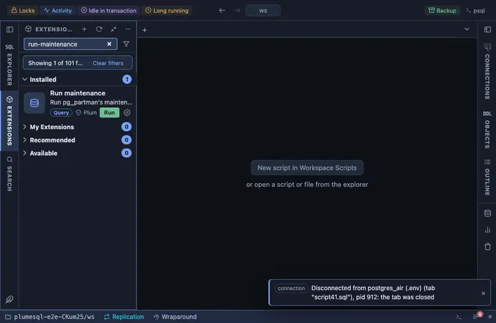

# Run maintenance

Run pg_partman's maintenance now, on every partition set it maintains:
create the partitions that are due and apply retention, exactly as the
scheduled run would. It asks first.

## What it does

Asks for the extension's schema, confirms, then calls
`run_maintenance()`.

## Inputs

| Input | Default | Meaning |
|---|---|---|
| partman_schema | partman | The schema pg_partman is installed in. |

## Requirements

PostgreSQL 13 or newer with the `pg_partman` extension. Its schema is the installer's choice (`partman` by the documentation's convention), so the form asks for it; the name is inlined as an identifier, quoted by the server itself, since a schema name cannot travel as a parameter. The privilege to run the maintenance procedure (the role that owns
the partition sets, or superuser).

## Notes

A writing extension, and under a retention a destructive one: it drops
or detaches the partitions past retention, which the question says. It
asks before it runs (`@confirm`).
