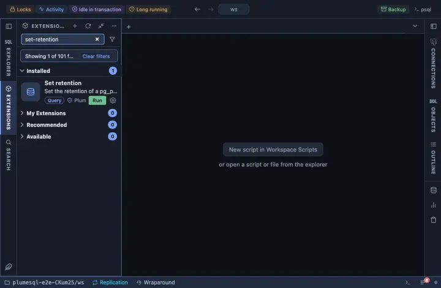

# Set retention

Set the retention of a pg_partman partition set from a form: how old a
partition may get, and whether it is then detached and kept as a plain
table or dropped. The next maintenance run applies it. It asks first.

## What it does

Asks the values, confirms, then updates the set's row in `part_config`
and answers with the row as it now stands; no row at all means the
parent is not a set the extension maintains.

## Inputs

| Input | Default | Meaning |
|---|---|---|
| partman_schema | partman | The schema pg_partman is installed in. |
| parent | asked | The parent table, as `schema.table`. |
| retention | 90 days | An interval; empty for no retention. |
| keep_table | true | `true` keeps old partitions as plain tables, `false` drops them. |

## Requirements

PostgreSQL 13 or newer with the `pg_partman` extension. Its schema is the installer's choice (`partman` by the documentation's convention), so the form asks for it; the name is inlined as an identifier, quoted by the server itself, since a schema name cannot travel as a parameter. UPDATE on `part_config`.

## Notes

A writing extension: it asks before it runs (`@confirm`), and the
question says that a retention which drops partitions drops their rows
with them. The values bind as parameters; only the schema is inlined.
